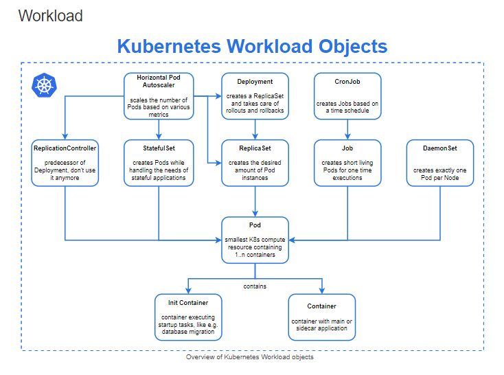
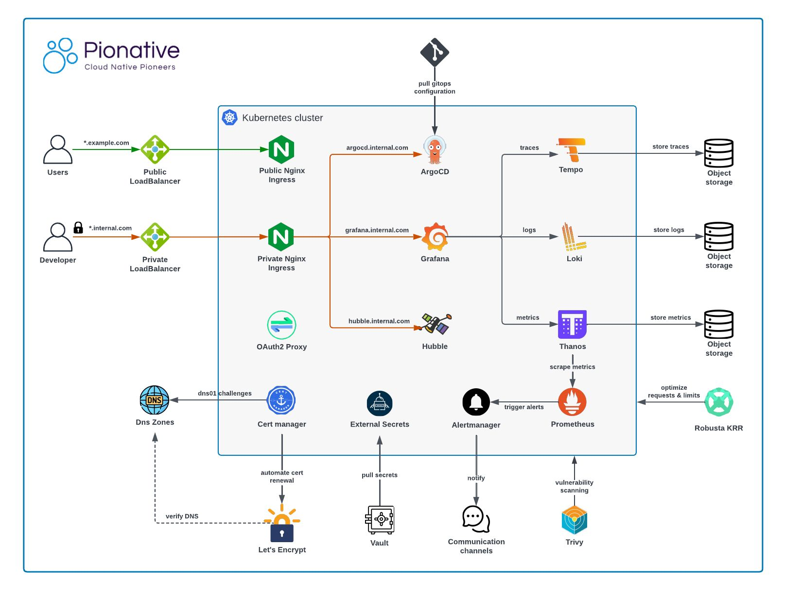
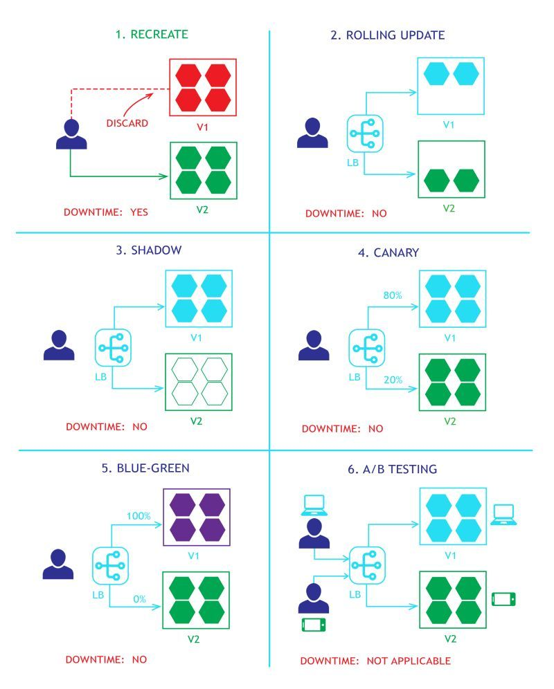
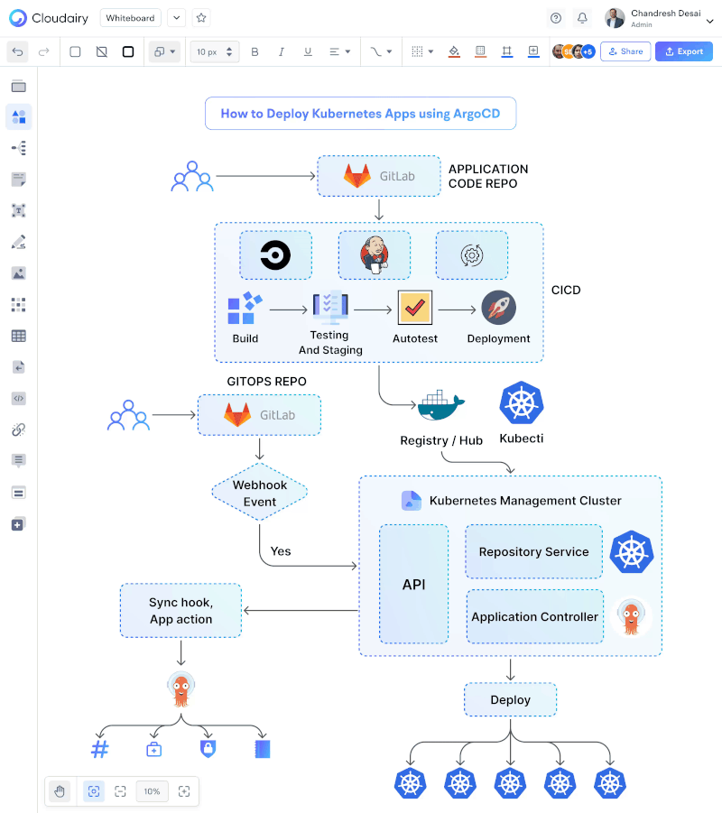

# Docker and Kubernetes Fundamentals Hands-On labs

Files for the **Docker and Kubernetes Fundamentals** Hands-On labs

[Watch the course on FreeCodeCamp's YouTube channel.](https://www.youtube.com/watch?v=kTp5xUtcalw "Watch the course")

The setup instructions are listed in this file at the root of the repo: K8sFundamentals-SetupGuide-V3.pdf

## About this course

- FREE COURSE
- Duration: 6+ hours of video training.
- 94 lectures.
- 37 Hands-On labs with step-by-step instructions and source code.
- Level: Introduction.
- No pre-requisites – Ideal for beginners. No coding experience is required.
- Target audience: Developers, DevOps, SREs and I.T. Pros.
- Required material: a laptop/PC/Mac supporting virtualization and capable of running Docker Desktop.
- Supported OS: Windows, MacOS and Linux (Ubuntu).

### Docker

Learn how to containerize applications with the Docker CLI and Visual Studio Code. Push and pull container images on Docker Hub, a container registry. Learn how to create multi-container applications using Docker Compose.​

### Kubernetes

Learn about the Kubernetes architecture and how it works. Run it locally and use the Kubernetes CLI and Visual Studio Code to run, debug and troubleshoot applications and services. Learn about pods and the different workloads available. Configure networking, storage and set liveness and readiness probes.

### No Cloud account required

This course does not require an account with a Cloud provider. Every lab runs locally using free software.

---

## Description

This technical course covers the core Docker and Kubernetes concepts and guides you to build containers. Developers, DevOps, SREs and I.T. Pros will learn how to use containers locally. You’ll experience several demos and hands-on exercises throughout the course as you learn how to build and deploy containers. No coding experience is required for the hands-on activities but you’ll use the terminal, command prompt and VS Code extensively.

You’ll learn about microservices and their use cases. You’ll then learn about containers and Kubenernetes. You’ll learn how to deploy and manage microservices applications packaged in containers locally. This will provide you the essential foundation that you’ll need before heading to the cloud.

---

## Meet your Instructor​

Guy Barrette is a developer/trainer with more then 25 years of experience. He worked for many years as a developer, solutions architect, Microsoft Certified Trainer and now he shares his passion for containers and microservices teaching Docker and Kubernetes. He was awarded Microsoft Most Valuable Professional in the Azure category and passed the following certifications: Kubernetes and Cloud Native Associate, Certified Kubernetes Application Developer (CKAD), Terraform Certified Associate, AWS Cloud Practitioner, Google Cloud Associate Cloud Engineer, Azure Fundamentals, Azure Developer Associate and Azure Architect Design.

https://guybarrette.com @GuyBarrette @guybarrette@techhub.social

